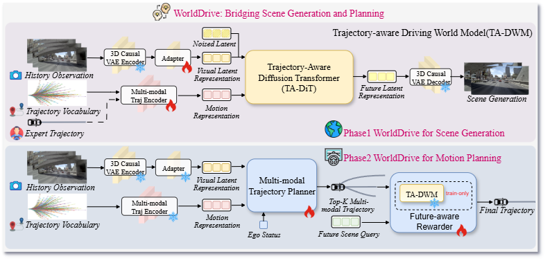

<div align="center">

<h1>Bridging Scene Generation and Planning:

Driving with World Model via Unifying Vision and Motion Representation</h1>


Xingtai Gui<sup>1</sup>, Meijie Zhang<sup>2</sup>, Tianyi Yan<sup>1</sup>, Wencheng Han<sup>1</sup>, Jiahao Gong<sup>2</sup>, Feiyang Tan<sup>2</sup>, Cheng-zhong Xu<sup>1</sup>, Jianbing Shen<sup>1</sup>  <br>
> 
<sup>1</sup>SKL-IOTSC, CIS, University of Macau, <sup>2</sup>Afari Intelligent Drive

<a href="https://arxiv.org/pdf/2512.00723">
</a>
<a href="https://huggingface.co/tabguigui/WorldTraj">
    
</a>
<a href="https://opensource.org/licenses/Apache-2.0">
    
</a>

</div>

---

## News
**[2026.3.15]** Release the WorldDrive Evaluation and Visualization script!\
**[2026.3.14]** Release the WorldDrive Project! 


## Table of Contents
- [News](#news)
- [Table of Contents](#table-of-contents)
- [Abstract](#abstract)
- [Overview](#overview)
- [Getting Started](#getting-started)
- [Checkpoint](#checkpoint)
- [Quick Evaluation](#quick-evaluation)
- [Visualize WorldDrive](#Visulize-WorldDrive)
- [Quick Training](#quick-training)
- [Contact](#contact)
- [Acknowledgement](#acknowledgement)
- [Citation](#citation)

--- 
## Abstract
End-to-end autonomous driving aims to generate safe and plausible planning policies from raw sensor input, and constructing an effective scene representation is a critical challenge. Driving world models have shown great potential in learning rich representations by predicting the future evolution of a driving scene. However, existing driving world models primarily focus on visual scene representation, and motion representation is not explicitly designed to be planner-shared and inheritable, leaving a schism between the optimization of visual scene generation and the requirements of precise motion planning. We present WorldDrive, a holistic framework that couples scene generation and real-time planning via unifying vision and motion representation. We first introduce a Trajectory-aware Driving World Model, which conditions on a trajectory vocabulary to enforce consistency between visual dynamics and motion intentions, enabling the generation of diverse and plausible future scenes conditioned on a specific trajectory. We transfer the vision and motion encoders to a downstream Multi-modal Planner, ensuring the driving policy operates on mature representations pre-optimized by scene generation. A simple interaction between motion representation, visual representation, and ego status can generate high-quality, multi-modal trajectories. Furthermore, to exploit the world model’s foresight, we propose a Future-aware Rewarder, which distills future latent representation from the frozen world model to evaluate and select optimal trajectories in real-time. Extensive experiments on the NAVSIM, NAVSIM-v2, and nuScenes benchmarks demonstrate that WorldDrive achieves state-of-the-art planning performance among vision-only methods while maintaining high-fidelity action-controlled video generation capabilities, providing strong evidence for the effectiveness of unifying vision and motion representation for robust autonomous driving. Our code and model will be made publicly available.

---
## Overview

<div align="center">

</div>


---

## Getting Started

We provide detailed guides to help you quickly set up, and evaluate WorldDrive:

- [Getting started from NAVSIM environment preparation](https://github.com/autonomousvision/navsim?tab=readme-ov-file#getting-started-)
- [Preparation of WorldDrive environment](docs/Installation.md)
- [WorldDrive Training and Evaluation](docs/Train_Eval.md)

## Checkpoint

👉 [Checkpoint](https://huggingface.co/tabguigui/WorldDrive/tree/main)


## Quick Evaluation

### Multi-modal Planner
#### Step1: cache dataset(3D causal VAE latents)
Download the pretrained 3D Causal VAE from offical CogvideoX-2B HF\
👉 [CogvideoX-2B VAE](https://huggingface.co/zai-org/CogVideoX-2b/tree/main)

```bash
sh scripts/cache/run_caching_trajworld_eval.sh # navtest for eval
```

#### Step2: evaluate planner
```bash
sh scripts/evaluation/run_worlddrive_planner_pdm_score_evaluation_stage1.sh
```


## Visulize WorldDrive

Generate planning result and corresponding future scene


```bash
sh scripts/visualization/worlddrive_visual.sh
```


---

## Quick Training

### Multi-modal Planner Training

#### Step1: cache dataset(3D causal VAE latents)

Download the anchor and corresponding formated PDMS\
👉 [Anchors](https://huggingface.co/tabguigui/WorldDrive/tree/main)
```bash
sh scripts/cache/run_caching_trajworld.sh # navtrain
```

#### Step2: download ta-dwm checkpoint
Download the corresponding ta-dwm checkpoint training on NAVSIM (*worldtraj_stage1_1024_tadwm*) or use the checkpoint training from [ta-dwm training](docs/Train_Eval.md).\
👉 [TA-DWM Model](https://huggingface.co/tabguigui/WorldDrive/tree/main)

#### Step3: train planner
```bash
sh scripts/training/run_worlddrive_planner.sh
```


## Contact
If you have any questions, please contact Xingtai via email (tabgui324@gmail.com)

## Acknowledgement
We thank the research community for their valuable support. WorldDrive is built upon the following outstanding open-source projects: \
[diffusers](https://github.com/huggingface/diffusers) \
[WoTE](https://github.com/liyingyanUCAS/WoTE)(End-to-End Driving with Online Trajectory Evaluation via BEV World Model (ICCV2025)) \
[Epona](https://github.com/Kevin-thu/Epona)(Epona: Autoregressive Diffusion World Model for Autonomous Driving) \
[Recogdrive](https://github.com/xiaomi-research/recogdrive)(A Reinforced Cognitive Framework for End-to-End Autonomous Driving) \
 
## Citation
If you find WorldDrive is useful in your research or applications, please consider giving us a star 🌟.
